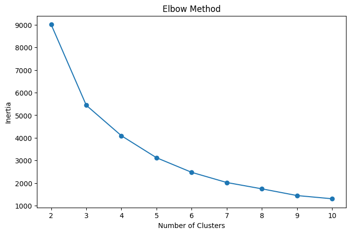
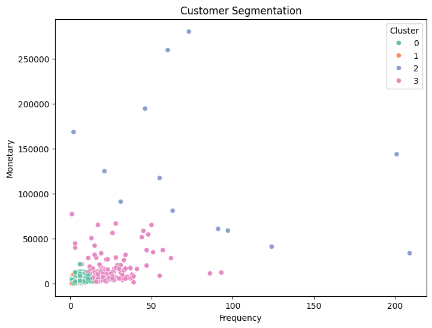

# Customer Segmentation Using RFM and K-Means

## Description

Customer segmentation project using RFM (Recency, Frequency, Monetary) analysis and K-Means clustering.

## Technologies

* Python
* Pandas
* NumPy
* Scikit-Learn
* Matplotlib
* Seaborn

## Process

1. Data Cleaning
2. RFM Calculation
3. Data Normalization
4. Elbow Method
5. K-Means Clustering
6. Silhouette Score Evaluation
7. Customer Segmentation

## Evaluation

The optimal number of clusters was determined using the Elbow Method and evaluated using K-Means clustering on the RFM (Recency, Frequency, Monetary) features.

**Silhouette Score:** 0.608

A total of **4 customer segments** were identified.

## Output

* Customer Segmentation Result
* Cluster Summary
* Excel Export

## Elbow Method

## Customer Segmentation

## Cluster Summary

| Cluster | Avg Recency | Avg Frequency | Avg Monetary | Customers | Description |
|----------|------------|-------------|-------------|-----------|-------------|
| 0 | 43.70 | 3.68 | 1,359.05 | 3,054 | Active customers with low-to-moderate purchasing activity. |
| 1 | 248.08 | 1.55 | 480.62 | 1,067 | Inactive customers with very low purchase frequency and spending. |
| 2 | 7.38 | 82.54 | 127,338.31 | 13 | High-value customers with very frequent purchases and extremely high spending. |
| 3 | 15.50 | 22.33 | 12,709.09 | 204 | Loyal customers with high purchase frequency and strong spending behavior. |

## Business Insight

Based on the customer segmentation results:

* **Cluster 2** represents the most valuable customers and should be prioritized through loyalty programs, premium services, and exclusive promotions.
* **Cluster 3** contains loyal customers with strong purchasing behavior and can be targeted with retention campaigns and personalized offers.
* **Cluster 0** represents active customers with moderate spending who have the potential to increase their purchase value through upselling and cross-selling strategies.
* **Cluster 1** consists of inactive customers who may require re-engagement campaigns, discounts, or promotional incentives to encourage future purchases.

## Output Files

The project generates the following outputs:

* `output/hasil_segmentasi_rfm.xlsx` — Customer segmentation results with cluster labels.
* `output/ringkasan_cluster.xlsx` — Summary statistics for each cluster.
* `images/elbow_method.png` — Elbow Method visualization.
* `images/customer_segmentation.png` — Customer segmentation visualization.
